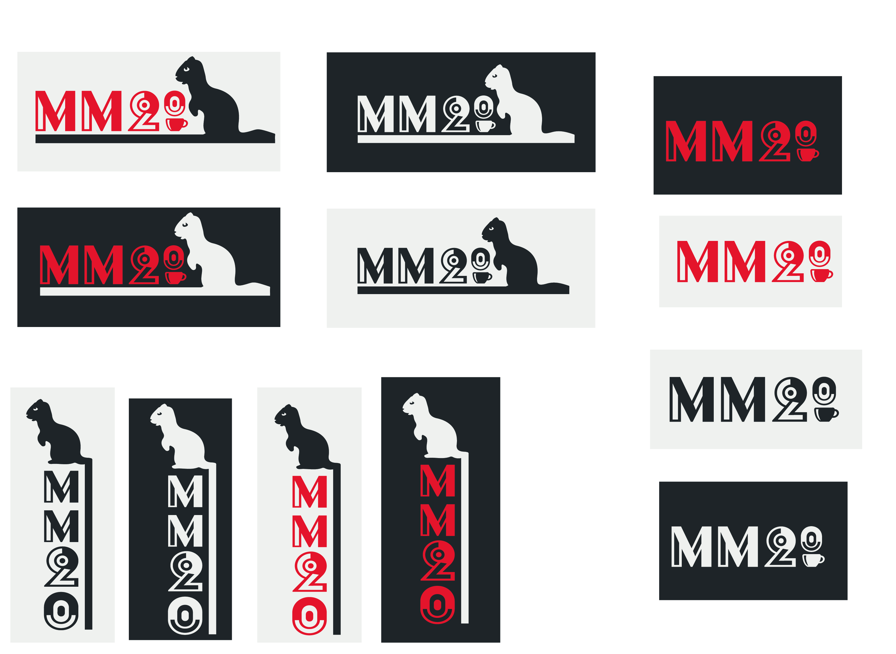

# Loodud logo

---

Punane on brändi peamine tunnusvärv, seega tuleks prioritiseerida värvilise logo kasutamist. Logo tuleb kasutada ühevärvilistel taustadel eelistatavalt meie poolt paika pandud mustal või valgel. Vajadusel on lubatud logo kuvada ühetooniliselt musta või valgena

